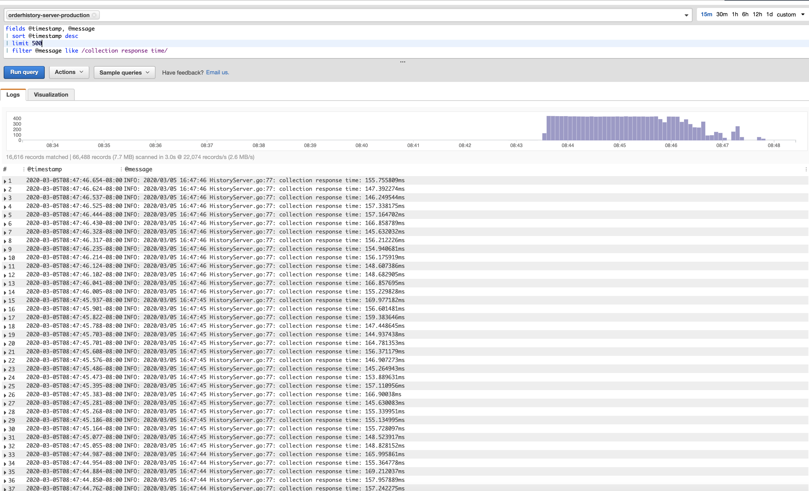
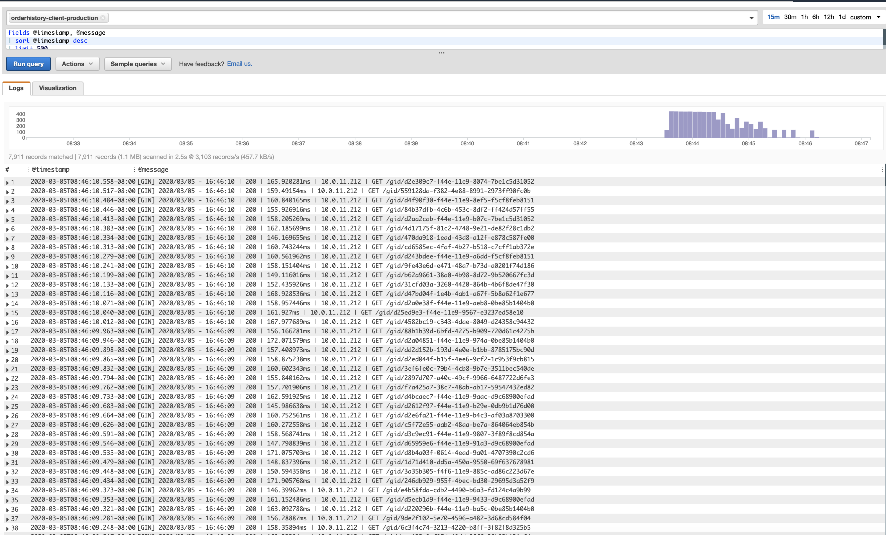
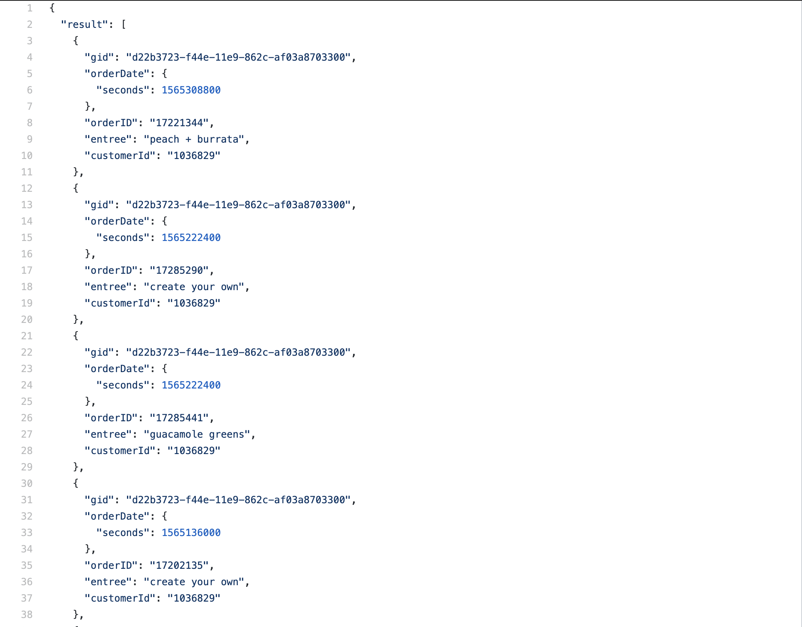

# sg-gRPC-orderhistory

gRPC client/server framework using protobuf as alternative to JSON and RESTful services.

Dependencies:
* [GoLang 1.12.8](https://golang.org/)
* [GO Utils library](https://github.com/polyglotDataNerd/poly-Go-utils)
* [Terraform](https://learn.hashicorp.com/terraform/getting-started/install.html)
* [AWS Managed Cassandra Service](https://aws.amazon.com/mcs/)
* [gRPC](https://grpc.io/docs/guides/)
* [protocbuf](https://developers.google.com/protocol-buffers)

TODO: (Verbose Doc) Proof of concept order history service using the universal user guid provided by DynamoDB ID service that powers a user history.

**Server**

*  Run Server
    
        go run HistoryServer.go

**Client**

**Sample Payload from gRPC to REST**
[orderhistory](https://github.com/sweetgreen/sg-gRPC-orderhistory/blob/master/orderhistory_payload.json)

   
*  Run Client
    
        go run HistoryClient.go
        
* Sample RESTful call using protobuf and GRPC using ID Service UUID: 

        curl http://orderhistory-client.orderhistory-production:9092/gid/d22b3723-f44e-11e9-862c-af03a8703300     
